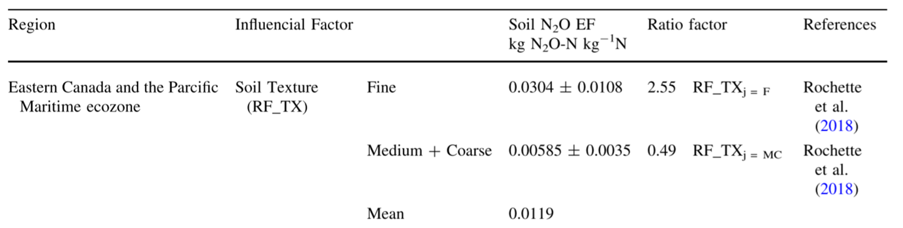

# Mapping USDA Soil Texture Classifications to RF_TX Values

This document outlines the methodology and assumptions used to map USDA soil texture classifications to RF_TX values.

## Introduction

The HOLOS software categorizes soil textures into three broad categories: fine, medium, and coarse, each associated with specific RF_TX values:

| Texture | RF_TX Value |
| ------- | ----------- |
| Fine    | 2.55        |
| Medium  | 1           |
| Coarse  | 0.49        |

In contrast, the USDA soil texture classification provides a more detailed breakdown, encompassing 13 distinct soil types. Our methodology aims to estimate RF_TX values for each detailed USDA classification and to provide a possible value range for each. This approach allows for more nuanced sensitivity analysis by accommodating the inherent variability within each soil texture type.

## Data Sources

The data for this analysis was primarily sourced from Holos software, Rochette et al. (2018), and Liang C et al. (2020). Additional data was derived from the USDA soil texture triangle.

## Analysis

### 1. RF_TX Values in HOLOS

The HOLOS software categorizes soil textures into three broad types—fine, medium, and coarse—each associated with specific RF_TX values {fine: 2.55, medium: 1, coarse: 0.49}. However, the derivation of these RF_TX values raises questions due to insufficient explanation in the provided documentation, which need further validation. A deeper examination of the sources cited by HOLOS, particularly Liang C et al. (2020).

**Figure** 1:  Data from Liang C et al. (2020)

#### Fine Soil Texture

The RF_TX value for fine soil texture in HOLOS is 2.55. This value appears to be based on empirical data from Rochette et al. (2018), which reports a nitrous oxide emission factor of $(0.0304 \pm 0.0108) \: kg \: N_2O-N \: kg^{-1} \: N$ for fine-textured soils. The RF_TX value is calculated as follows:

$$
{RF\_{TX}_{Fine}}  = \frac{0.0304}{0.0119} \approx 2.55
$$

Here, 0.0119 is a reference mean value.

#### Medium Soil Texture

In Holos, the RF_TX value for medium soil texture is 1 as baseline, which is corresponding to an emission factor of $0.0019 \: kg \: N_2O-N \: kg^{-1} \: N$, but its source is not explicitly stated in both Liang C et al. (2020), Rochette et al. (2018), and Holos, which requires further investigation to confirm its validity.

#### Coarse Soil Textures

For coarse soil textures, HOLOS assigns an RF_TX value of 0.49, which actually derived from the averaging nitrous oxide emission factors of medium and coarse soils, as reported in Rochette et al. (2018). Using the same reference mean value of 0.0119, the RF_TX value is:

$$
{RF\_{TX}_{Coarse}}  = \frac{0.00585}{0.0119} \approx 0.49
$$

In summary, HOLOS assigns an RF_TX value of 2.55 (corresponding to $N_2O$ emission factor 0.0304) for fine soil textures. For coarse soil textures, it uses an averaged RF_TX value of 0.49 (corresponding to $N_2O$ emission factor 0.0058). The RF_TX value of 1 (corresponding to $N_2O$ emission factor 0.0119) serves as a reference for medium textures. These values form the baseline for our subsequent estimations and analyses.

### 2. USDA Soil Texture Classes

The USDA classification system defines 13 distinct soil texture types based on the proportions of clay, silt, and sand. These soil textures are identified as follows:

1. Clay (heavy)
2. Silty clay
3. Clay
4. Silty clay loam
5. Clay loam
6. Silt
7. Silt loam
8. Sandy clay
9. Loam
10. Sandy clay loam
11. Sandy loam
12. Loamy sand
13. Sand

**Figure** 2:  Soil texture classification (Cornell University 2017)

Based on the Soil Texture Triangle, we can get:

| Soil Type       | Clay     | Silt     | Sand     |
| --------------- | -------- | -------- | -------- |
| Clay (heavy)    | 60 - 100 | 0 - 40   | 0 - 40   |
| Silty clay      | 40 - 60  | 40 - 60  | 0 - 20   |
| Clay (light)    | 40 - 60  | 0 - 40   | 0 - 45   |
| Silty clay loam | 27 - 40  | 20 - 73  | 0 - 20   |
| Clay loam       | 27 - 40  | 0 - 50   | 20 - 45  |
| Silt            | 0 - 12   | 80 - 100 | 0 - 20   |
| Silt loam       | 0 - 27   | 50 - 88  | 0 - 50   |
| Sandy clay      | 35 - 55  | 0 - 20   | 45 - 65  |
| Loam            | 7 - 27   | 30 - 50  | 23 - 52  |
| Sandy clay loam | 20 - 35  | 0 - 20   | 45 - 80  |
| Sandy loam      | 0 - 20   | 0 - 50   | 43 - 80  |
| Loamy sand      | 0 - 15   | 0 - 30   | 70 - 100 |
| Sand            | 0 - 10   | 0 - 10   | 80 - 100 |

(The range of components in the table needs further precise confirmation)

### Conclusion

**1. Estimating RF_TX from Soil Texture Components using Weighted Averages:**

Utilizing a weighted average to estimate RF_TX values for each soil texture type in the USDA classification allows for the comprehensive consideration of the proportional impact of clay, silt, and sand on nitrous oxide emissions:

$$
{RF\_TX} = (\% \text{Clay} \times {RF\_TX}_{\text{Clay}}) + (\% \text{Silt} \times {RF\_TX}_{\text{Silt}}) + (\% \text{Sand} \times {RF\_TX}_{\text{Sand}})
$$

**2. Estimating RF_TX_Clay, RF_TX_Silt, and RF_TX_Sand:**

In the HOLOS model, soils are broadly classified into three categories: fine, medium, and coarse. The corresponding RF_TX values are:

- **Fine:** 2.55
- **Medium:** 1.00
- **Coarse:** 0.49

These values can be regarded as mean RF_TX values corresponding to different soil texture classes in the USDA classification. Considering that clay, silt, and sand represent extreme points of the soil texture triangle, they can be viewed as the upper and lower limits of the distribution. With available mean and standard deviation data, confidence intervals can be utilized to estimate these limits effectively.

## Methodology

### 1. Estimating RF_TX_Clay, RF_TX_Silt, and RF_TX_Sand

**RF_TX_Clay:**

According to the reference, the mean and standard deviation of emission factor for fine textures are $(0.0304 \pm 0.0108) \: kg \: N_2O-N \: kg^{-1} \: N$ and the number of observations is n = 41 (Rochette et al. (2018)). Assuming a normal distribution, the 99% confidence interval of the emission factor is approximately (0.026, 0.0347). The upper limit of this interval, 0.0347, can be used as the most fine (clay) RF_TX value.

$$
\text{CI} = \text{mean}_{\text{fine}} \pm (Z_{\alpha/2} \times \frac{{std\_{dev}}_{\text{fine}}}{\sqrt{n_{\text{fine}}}})
$$

The ${RF\_{TX}_{Clay}}$ can be calculated as:

$$
{RF\_{TX}_{Clay}} = \frac{0.0347}{0.0119} \approx 2.91
$$

Here, 0.0119 is the reference mean value used in the HOLOS model.

**RF_TX_Silt:**

For silt, we set the RF_TX to be the medium value, 1.00, as a middle reference point:

$$
{RF\_TX}_{Silt} = 1.00
$$

**RF_TX_Sand:**

Similarly, for coarse textures, the mean and standard deviation are $(0.00585 \pm 0.0035) \: kg \: N_2O-N \: kg^{-1} \: N$ and the number of observations is 38 (Rochette et al. (2018)). Assuming a normal distribution as well, the 99% confidence interval is approximately (0.00439, 0.00731). The lower limit of this interval, 0.00439, can be used as the most coarse (sand) RF_TX value.

$$
\text{CI} = \text{mean}_{\text{Coarse}} \pm (Z_{\alpha/2} \times \frac{{std\_dev}_{\text{Coarse}}}{\sqrt{n_{\text{Coarse}}}})
$$

The ${RF_{}X}_{Coarse}$ can be calculated as:

$$
\text{RF\_TX}_{Sand} = \frac{0.00439}{0.0119} \approx 0.37
$$

Using these calculations, we estimate:

- **RF_TX_Clay:** 2.91
- **RF_TX_Silt:** 1.00
- **RF_TX_Sand:** 0.37

These estimates account for the variability within each soil texture class and provide a more accurate estimation of RF_TX values for each USDA soil texture class.

### 2. Calculating the Range

In scientific mode, we need to get the reasonable range of the RF_TX values for each soil texture class. The following steps can be taken to calculate the range of RF_TX values for each soil texture class:

- Generate all possible combinations of clay, silt, and sand percentages within their respective ranges. Make sure the total sum is 100%.
- For each combination of clay, silt, and sand percentages, calculate the RF_TX using the formula:

$$
{RF\_TX} = (\% \text{Clay} \times {RF\_TX}_{\text{Clay}}) + (\% \text{Silt} \times {RF\_TX}_{\text{Silt}}) + (\% \text{Sand} \times {RF\_TX}_{\text{Sand}})
$$

- Identify the minimum and maximum RF_TX values from the generated combinations.

### 3. Calculating the Default Values

In farmer mode, only a single value of RF_TX is needed for each soil texture class. So we use the following strategy to calculate the default RF_TX values:

- Use a prioritization strategy (can be adjusted) to map the percentages of clay, silt, and sand to specific percentages:
  - For clay soils, prioritize clay and silt, with sand as the residual.
  - For silt soils, prioritize silt and clay, with sand as the residual.
  - For sandy soils, prioritize sand and clay, with silt as the residual.
- From priority high to low, calculate the median value of the percentage ranges, and the residues are adjusted to make the total sum 100%.
- Using the prioritized median percentages, calculate the default RF_TX value with the same formula used for generating combinations:

$$
{RF\_TX} = (\% \text{Clay} \times {RF\_TX}_{\text{Clay}}) + (\% \text{Silt} \times {RF\_TX}_{\text{Silt}}) + (\% \text{Sand} \times {RF\_TX}_{\text{Sand}})
$$

## Results

Here are the results from the mapping process (can be adjusted by user-defined strategies):

| Soil Texture    | RF_TX Min | RF_TX Max | RF_TX |
| --------------- | --------- | --------- | ----- |
| Clay (heavy)    | 1.899     | 2.92      | 2.54  |
| Silty clay      | 1.642     | 2.152     | 1.96  |
| Clay (light)    | 1.484     | 2.152     | 1.77  |
| Silty clay loam | 1.392     | 1.768     | 1.52  |
| Clay loam       | 1.234     | 1.642     | 1.38  |
| Silt            | 0.874     | 1.23      | 1.09  |
| Silt loam       | 0.684     | 1.518     | 1.15  |
| Sandy clay      | 1.262     | 1.772     | 1.58  |
| Loam            | 0.806     | 1.373     | 1.09  |
| Sandy clay loam | 0.879     | 1.388     | 1.13  |
| Sandy loam      | 0.495     | 1.112     | 0.8   |
| Loamy sand      | 0.369     | 0.846     | 0.61  |
| Sand            | 0.369     | 0.687     | 0.53  |

## Discussion

The methodology successfully maps USDA soil textures to RF_TX values, incorporating statistical methods to ensure robust and reliable estimations. These mappings are crucial for accurately modeling soil behaviors in agricultural and environmental studies.

### Future Improvements

The exact process used by HOLOS to derive RF_TX values remains unclear due to the lack of detailed methodology in the reference documentation. Further analysis and possibly direct communication with the authors of the primary sources might be required to fully understand and accurately apply these RF_TX values in soil behavior modeling.

## References

- Rochette P, Worth D E, Lemke R L, et al. Estimation of N2O emissions from agricultural soils in Canada. I. Development of a country-specific methodology[J]. Canadian Journal of Soil Science, 2008, 88(5): 641-654.
- Liang C, MacDonald D, Thiagarajan A, et al. Developing a country specific method for estimating nitrous oxide emissions from agricultural soils in Canada[J]. Nutrient Cycling in Agroecosystems, 2020, 117: 145-167.
- Rochette P, Liang C, Pelster D, et al. Soil nitrous oxide emissions from agricultural soils in Canada: Exploring relationships with soil, crop and climatic variables[J]. Agriculture, Ecosystems & Environment, 2018, 254: 69-81.
- Cornell University. (2017). Soil Health - Soil Texture Fact Sheet. [Cornell University School of Integrative Plant Sciences - Soil Health Manual Series](https://cpb-us-e1.wpmucdn.com/blogs.cornell.edu/dist/f/5772/files/2016/12/04_CASH_SH_Series_Texture_Fact_Sheet_072717-286kw9f.pdf)
